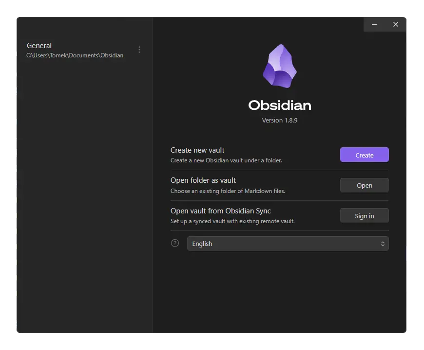

<p align="center">
    
</p>

# Start-Obsidian-Vault-Manager
Start Obsidian Vault Manager at startup

## ❓ What it does

By default Obsidian opens **last visited Vault**.

This script makes Obsidian **always open Vault Manager**

###### (currently only windows is supported)


## ❕Important❕

This script has to be run before Obsidian is open - this scripts automates it.

Here it opens Obsidian after executing the script so **it is recommended to replace original Obsidian shortcuts with shortcuts to provided files**.

## 🧩 Installation
###### instructions assume default Obsidian installation location is used. If in your case it is different, adjust accordingly
(In the future installation script will be available)

### 1. Instalation

- Move `vault-manager.cmd`, `start-vault-manager.cmd.vbs` files to `C:\Users\USER\AppData\Local\Programs\obsidian` (where `USER` is your username)
- Create a shortcut to `start-vault-manager.cmd.vbs` in the same directory. - **This will be your new default starting point for Obsidian.**
- Rename it to for example "obsidian-vaults". (remember to use different name than "Obsidian")
- In Properties change its icon by choosing the `Obsidian.exe`.

Now replace every old Obsidian shortcut with your new one (those shortcuts you can rename to "Obsidian").

### 2. Tip - Search launching:
When using Windows Search (or PowerToys Run) it will still point to old Obsidian shortcut.

Remove old:
- Remove `Obsidain` shortcut form `C:\ProgramData\Microsoft\Windows\Start Menu\Programs`.

Add new:
- Open `C:\Users\Tomek\AppData\Roaming\Microsoft\Windows\Start Menu\Programs` directory and make a shortcut to `obsidian-vaults` (new Obsidian Shortcut).
- Here you can rename it to "Obsidian".

###### You can add new shortcut to original directory `C:\ProgramData\Microsoft\Windows\Start Menu\Programs` however you need admin privileges.

## ⚙️ How It works

Obsidian stores information about last visited Vault inside `obsidian.json` file in default install location `\AppData\Roaming\obsidian\obsidian.json` by adding `"open":true` next to last visided one.

This script removes `"open":true` part forcing Obsidian to open Vault Manager.

`vault-manager.cmd`
```cmd
@echo off
setlocal

:: Define file path
set "input_file=%USERPROFILE%\AppData\Roaming\obsidian\obsidian.json"
set "search_string=,\"open\":true"
set "temp_file=%USERPROFILE%\AppData\Roaming\obsidian\temp.json"

:: Check if the file exists
if not exist "%input_file%" (
    echo File "%input_file%" not found.
    exit /b 1
)

:: Use PowerShell to replace the exact text inside the file
powershell -Command "(Get-Content '%input_file%') -replace '%search_string%', '' | Set-Content '%temp_file%'"

:: Replace original file with the modified one
move /y "%temp_file%" "%input_file%" >nul

:: Start obsidian

powershell -Command "Start-Process '%USERPROFILE%\AppData\Local\Programs\obsidian\Obsidian.exe' -NoNewWindow -PassThru | Out-Null"
```

Because it is nice to not see command prompt pop up for a split second another file is introduced executing script in background.

`start-vault-manager.cmd.vbs`
```vbs
Set objShell = CreateObject("WScript.Shell")
objShell.Run "cmd.exe /c C:\Users\Tomek\AppData\Local\Programs\obsidian\vault-manager.cmd", 0, False
Set objShell = Nothing
```

---

# ToDo
- [ ] installation script

# License
This project is licensed under the MIT license