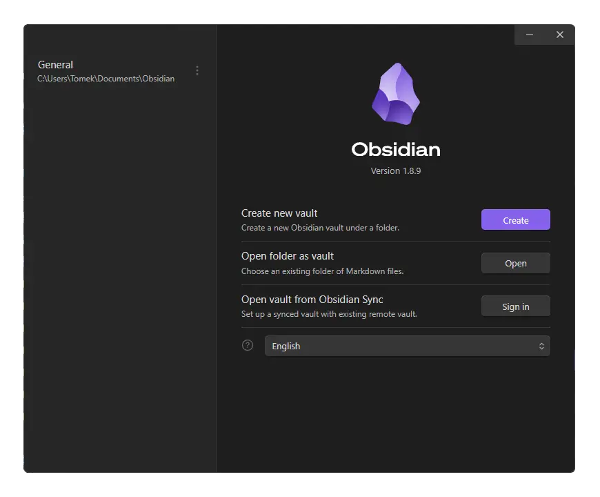

    

# Start-Obsidian-Vault-Manager
Start Obsidian Vault Manager at startup

## ❓ What it does

By default Obsidian opens **last visited Vault**.

This script makes Obsidian **always open Vault Manager**

###### (currently only windows is supported)

## ❕Important❕

This script has to be run before Obsidian is open - this scripts automates it.

Here it opens Obsidian after executing the script so **it is recommended to replace original Obsidian shortcuts with shortcuts to provided files**.

## 🧩 Installation
###### instructions assume default Obsidian installation location is used. If in your case it is different, adjust accordingly
###### (In the future installation script will be available)

- Move `vault-manager.cmd` and `start-vault-manager.cmd.vbs` to `C:\Users\USER\AppData\Local\Programs\obsidian` (where `USER` is your username).
- Create a shortcut to `start-vault-manager.cmd.vbs` and use it as your new starting point for Obsidian. 

Detailed installation [here](README-resources/INSTALLATION.md) (recommended)

## ⚙️ How It works

Obsidian stores information about last visited Vault inside `obsidian.json` file in default install location `\AppData\Roaming\obsidian\obsidian.json` by adding `"open":true` next to last visided one.

This script removes `"open":true` part forcing Obsidian to open Vault Manager.

Explanation with code files [here](README-resources/HOW-IT-WORKS.md)

---
# Support my work

# ToDo
- [ ] installation script

# License
This project is licensed under the MIT license